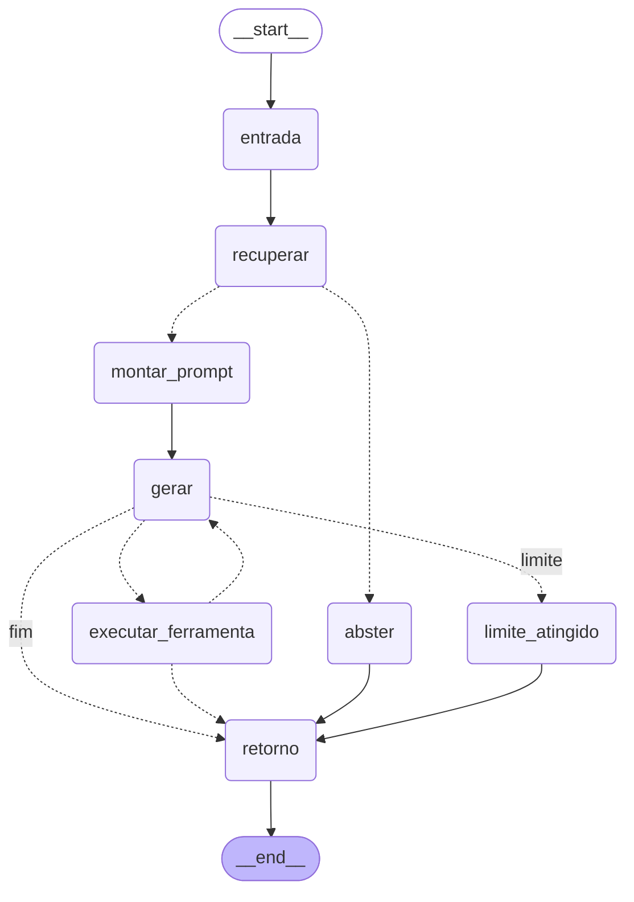

# Mika AI
### Plataforma Inteligente de Atendimento e Agendamento

## Visão Geral

O Mika AI é uma plataforma de atendimento automatizado com Inteligência Artificial capaz de responder dúvidas com base em documentos internos da empresa (RAG) e conduzir fluxos de agendamento de forma conversacional.

Para demonstrar a solução, foi utilizado um cenário fictício de clínica odontológica, mas a arquitetura foi pensada para ser adaptável a outros contextos de atendimento: trocar os PDFs da pasta de documentos é suficiente para mudar de domínio.

---

# Problema

Empresas frequentemente enfrentam desafios com:

- Responder dúvidas recorrentes manualmente;
- Centralizar informações institucionais;
- Realizar agendamentos respeitando regras operacionais;
- Evitar conflitos de horários e erros humanos;
- Escalar atendimento sem aumentar carga operacional.

---

# Solução Proposta

A solução utiliza IA para:

- Responder perguntas com base nos documentos da empresa (RAG);
- Recusar-se a responder quando a base não sustenta a resposta;
- Citar a fonte utilizada em cada resposta;
- Conduzir fluxos conversacionais para agendamento;
- Coletar as informações obrigatórias do cliente;
- Consultar prestadores e horários reais no banco de dados.

---

# Pipeline de RAG

O núcleo da aplicação é o pipeline abaixo. O backend é organizado por responsabilidade, e não por camada técnica: `api/rag/` cuida só do pipeline de recuperação, `api/llm/` só do provedor de IA, `api/prompt/` só do texto enviado ao modelo, e `api/chat/` orquestra os três para atender uma mensagem.

| # | Etapa | Módulo responsável |
|---|---|---|
| 1 | Coleta do conteúdo do domínio | `rag/ingestion.py` |
| 2 | Limpeza e organização dos textos | `rag/cleaning.py` |
| 3 | Quebra do conteúdo em chunks | `rag/chunking.py` |
| 4 | Geração de embeddings | `rag/embedding.py` |
| 5 | Armazenamento em índice vetorial | `rag/vectorstore.py` |
| 6 | Recebimento da pergunta pela interface | `chat/router.py` / `chat.tsx` |
| 7 | Recuperação dos chunks mais relevantes | `chat/graph.py` (nó `recuperar`) + `rag/retrieval.py` |
| 8 | Montagem do contexto (chunks + histórico) | `chat/graph.py` (nó `montar_prompt`) + `rag/retrieval.py` |
| 9 | Geração da resposta final | `chat/graph.py` (nó `gerar`) + `llm/groq_provider.py` |
| 10 | Exibição da resposta no chat | `chat/graph.py` (nó `retorno`) + `chat.tsx` |

`rag/service.py` é a fachada que compõe ingestão + chunking + embedding + índice + recuperação num único `RagService`. `chat/graph.py` é quem orquestra as etapas 6 a 10 como um grafo — ver seção **Orquestração com LangGraph** abaixo.

## 1. Coleta

Leitura dos PDFs de `api/docs/` com `pypdf`. Cada documento recebe identidade própria — `id`, `titulo` e `fonte` — que é propagada por todo o pipeline até a citação na resposta final.

## 2. Limpeza

O texto extraído de um PDF carrega ruído de diagramação que degrada o embedding. São removidos:

- cabeçalho e rodapé, detectados por repetição **nas primeiras e últimas linhas** de cada página;
- linhas que contêm apenas número de página;
- quebras de linha no meio de frases (preservando a separação de parágrafos);
- hifenização de fim de linha (`odonto-\nlogia` → `odontologia`).

A detecção atua apenas na borda da página, e não na página inteira, justamente para não apagar conteúdo legítimo: palavras curtas e números soltos (número de rua, CEP) também se repetem entre páginas. Medido na base atual, a limpeza remove **1,2%** do texto.

## 3. Chunking

Divisão **por palavra** (não por caractere, que partiria palavras ao meio), com identidade preservada: `chunk_id`, `documento_id`, `titulo` e `fonte`.

Padrão: **70 palavras com 15 de sobreposição**. O tamanho não é arbitrário — o modelo de embedding tem janela de 128 tokens, e em português uma palavra gera de 1,5 a 2 tokens. Chunks maiores seriam truncados silenciosamente na hora de gerar o vetor, deixando parte do conteúdo fora do índice. A sobreposição evita que uma informação na fronteira entre dois chunks se perca.

## 4. Embeddings

Modelo: **`sentence-transformers/paraphrase-multilingual-MiniLM-L12-v2`**.

A escolha do modelo multilíngue é decisiva: os documentos estão em português, e um modelo treinado apenas em inglês produz similaridades próximas do ruído para esse conteúdo. Os vetores são normalizados e gerados em lote.

## 5. Índice vetorial

ChromaDB em modo **persistente** (`PersistentClient`), gravado em `api/vectorstore/`, com espaço de distância `cosine`.

O índice guarda uma impressão digital da pasta de documentos (nome, tamanho e data de modificação de cada arquivo) junto com o modelo e os parâmetros de chunking. Se qualquer PDF for adicionado, removido ou alterado, o índice é reconstruído automaticamente na próxima execução; caso contrário, é reaproveitado.

## 6. Recebimento da pergunta

`POST /chat/` recebe `{ message, session_id }`. O `session_id` é gerado no navegador e guardado em `localStorage`, mantendo o histórico da conversa entre mensagens.

## 7. Recuperação

Busca vetorial pelos `top_k` chunks mais próximos, preservando **score e metadados**.

Dois mecanismos são aplicados sobre o resultado:

**Reformulação da pergunta.** Perguntas curtas costumam ser anafóricas — "e quanto custa?" não carrega assunto nenhum. Quando a mensagem tem menos de 6 palavras, a pergunta anterior do usuário é concatenada antes de gerar o vetor de busca.

**Limiar de evidência.** A busca vetorial *sempre* devolve os vizinhos mais próximos, mesmo quando nenhum deles responde à pergunta. O score máximo é comparado com um limiar configurável; abaixo dele, considera-se que não há evidência. Chunks muito abaixo do topo do ranking também são descartados, porque só consomem contexto.

## 8. Montagem do contexto

Os chunks aprovados viram um contexto rotulado por fonte:

```
[Fonte 1 - Pagamentos, Orçamentos e Convênios]
<trecho do documento>
```

Ao contexto soma-se uma janela das últimas mensagens da conversa, limitada para não crescer indefinidamente.

## 9. Geração

Groq com `openai/gpt-oss-120b`, `temperature=0.1` (em RAG a resposta deve seguir o contexto, não ser criativa) e limite de tokens definido.

O prompt do sistema obriga o modelo a responder somente com base no contexto, a citar `[Fonte X]` e a ignorar instruções embutidas na mensagem do usuário que tentem alterar essas regras.

**Abstenção:** se não há evidência e o turno é uma pergunta, o assistente responde *"Não encontrei essa informação na base consultada."* sem sequer chamar a LLM. A abstenção é suprimida durante um agendamento em andamento, onde a mensagem do usuário é um dado do fluxo e não uma pergunta à base.

## 10. Exibição

A mensagem do usuário aparece imediatamente, há indicador de digitação enquanto a resposta é processada, e falhas de rede viram uma mensagem visível no chat. A conversa é persistida em `localStorage`.

---

# Orquestração com LangGraph

As etapas 6 a 10 são organizadas como um `StateGraph` do LangGraph (`api/chat/graph.py`), não como uma função sequencial. Cada nó do grafo é fino de propósito — chama uma função já isolada em `api/rag/`, `api/llm/` ou `api/prompt/` — o grafo só decide a ordem e as bifurcações.



| Nó | Etapa | O que faz |
|---|---|---|
| `entrada` | 6 — entrada da pergunta | Sanitiza a mensagem; detecta se o turno é de agendamento |
| `recuperar` | 6.5 e 7 — recuperação de contexto | Reformula a pergunta com o histórico, busca no índice vetorial, calcula score máximo e decide se há evidência |
| `montar_prompt` | 8 — montagem do prompt | Filtra os chunks relevantes e monta o system prompt (contexto + serviços) |
| `gerar` | 9 — chamada da LLM | Chama o Groq; extrai um eventual comando JSON de ferramenta da resposta |
| `executar_ferramenta` | — | Executa a ferramenta pedida (consulta prestadores/horários, agenda) e realimenta o resultado |
| `abster` | — | Resposta de abstenção sem acionar a LLM |
| `limite_atingido` | — | Interrompe o ciclo de ferramentas após o limite de rodadas |
| `retorno` | 10 — retorno da resposta | Garante que sempre há uma resposta não vazia a devolver |

Duas arestas condicionais concentram as decisões do fluxo:

- **`recuperar → montar_prompt | abster`**: a mesma lógica do material da disciplina — a busca vetorial sempre devolve os vizinhos mais próximos, então a decisão de acionar ou não a LLM é feita antes da geração, com base no score.
- **`gerar → executar_ferramenta | limite_atingido | retorno`**: fecha um ciclo (`gerar ⇄ executar_ferramenta`) para o tool calling manual por JSON — uma extensão do fluxo básico de RAG, sugerida como evolução no material de referência (ferramentas, ciclos).

`ChatService` (`api/chat/service.py`) ficou responsável só pelo que é externo ao grafo: obter/persistir a sessão da conversa e resolver a lista de serviços antes de invocar `ChatGraph.executar(...)`.

---

# Arquitetura

## Frontend
- Next.js (App Router) com Tailwind
- Chat integrado à página institucional
- Comunicação com a API FastAPI

## Backend
- Python + FastAPI
- `prestador` e `horario_marcado`: camadas técnicas `routers` → `controllers` → `services` → `repository` → `models`
- `chat`, `rag`, `llm` e `prompt`: módulos por responsabilidade (cada um resolve uma parte do pipeline de IA, independente dos demais)
- `ChatService` (`api/chat/service.py`) delega a execução do turno a um `StateGraph` do LangGraph (`api/chat/graph.py`), que orquestra `RagService`, o provedor de LLM e as ferramentas

## IA
- Groq — `openai/gpt-oss-120b` (geração)
- Sentence Transformers — MiniLM multilíngue (embeddings)
- ChromaDB persistente (índice vetorial)

## Banco de Dados
- PostgreSQL (Neon)

---

# Fluxo da Aplicação

```
Usuário envia mensagem
        ↓
Frontend envia para a API
        ↓
ChatService reformula a pergunta com o histórico
        ↓
Recuperação no índice vetorial  →  score máximo
        ↓
        ├── sem evidência + é pergunta  →  abstenção (não chama a LLM)
        │
        └── com evidência ou agendamento
                ↓
        Monta contexto [Fonte X] + janela do histórico
                ↓
        LLM gera a resposta
                ↓
        ├── resposta em texto  →  devolve ao usuário
        │
        └── comando JSON  →  backend executa a ação
                                ↓
                        consulta prestadores
                        consulta horários ocupados
                        cria agendamento
                                ↓
                        realimenta a LLM (até 4 rodadas)
```

---

# Estratégia de Tool Calling

Como o modelo utilizado não possui suporte nativo a function/tool calling, foi implementada uma estratégia alternativa baseada em comandos estruturados em JSON gerados pelo prompt. Esses comandos são interceptados e convertidos pelo backend em ações reais.

```json
{
  "action": "get_prestadores_servico",
  "servico": "Limpeza"
}
```

Ferramentas disponíveis: `get_prestadores_servico`, `get_horarios_ocupados` e `agendar`.

Cuidados adotados na implementação:

- **Limite de rodadas** (4 por mensagem), evitando laço infinito caso o modelo insista em emitir comandos;
- **O JSON nunca chega ao usuário** — o bloco é removido do texto exibido;
- **Resultados de ferramenta são realimentados com um marcador**, que é removido de qualquer mensagem digitada pelo usuário, impedindo que alguém forje um resultado falso para induzir um agendamento.

---

# Estrutura do Projeto

```bash
front-end/
  app/
  components/
    chat.tsx

back-end/
  api/
    chat/                  # orquestração do assistente (feature module)
      router.py            # etapa 6 — endpoint POST /chat/ e GET /chat/status
      controller.py        # validação da requisição
      service.py           # ChatService — obtém a sessão e invoca o grafo
      graph.py             # StateGraph do LangGraph — etapas 6 a 10 (ver diagrama acima)
      session_store.py     # histórico e estado de agendamento por sessão
      tools.py             # tool calling: extrai e executa o JSON da LLM
      turn_classifier.py   # heurísticas: turno é pergunta? é agendamento?

    rag/                    # pipeline de RAG (feature module)
      ingestion.py          # etapa 1 — leitura dos documentos
      cleaning.py           # etapa 2 — limpeza do texto extraído
      chunking.py           # etapa 3 — divisão em chunks
      embedding.py          # etapa 4 — modelo de embeddings
      vectorstore.py        # etapa 5 — índice ChromaDB persistente
      retrieval.py          # etapas 7 e 8 — busca, evidência, contexto
      service.py            # RagService — fachada que compõe tudo acima
      cli.py                # indexação e diagnóstico via linha de comando

    llm/                     # SÓ a configuração do provedor de IA em uso
      base.py                # contrato LLMProvider (permite trocar de provedor)
      groq_provider.py        # cliente Groq + parâmetros de geração (etapa 9)

    prompt/                   # texto enviado à LLM
      mika.py                 # persona + regras + frase de abstenção
      servicos.py              # lista de serviços (dado de negócio no prompt)

    services/                  # prestador e horario_marcado (CRUD simples)
      prestador_service.py
      horario_marcado_service.py
    routers/
    controllers/
    repository/
    models/
    schemas/
    docs/                       # PDFs indexados
    vectorstore/                # índice gerado (não versionado)
```

`prestador` e `horario_marcado` continuam na estrutura em camadas (`routers/`, `controllers/`, `services/`, `repository/`, `models/`) porque são CRUD convencional; `chat`, `rag`, `llm` e `prompt` são módulos verticais porque cada um é uma peça independente do pipeline de IA, testável e substituível por conta própria — por exemplo, trocar o Groq por outro provedor toca só em `api/llm/`.

---

# Tecnologias Utilizadas

| Camada | Tecnologia |
|---|---|
| Frontend | Next.js, React, Tailwind, Axios |
| Backend | FastAPI, Python, SQLAlchemy, Pydantic |
| Orquestração do fluxo de RAG | LangGraph |
| Geração | Groq — `openai/gpt-oss-120b` |
| Embeddings | Sentence Transformers — `paraphrase-multilingual-MiniLM-L12-v2` |
| Índice vetorial | ChromaDB (persistente) |
| Extração de PDF | pypdf |
| Banco | PostgreSQL (Neon) |

---

# Como Executar

Abra o projeto no Codespace.

## Backend

```bash
cd back-end
python -m venv venv
source venv/bin/activate
pip install -r requirements.txt
```

Crie um arquivo `.env` com:

```
llm_api_key=
database_url=
debug=True
```

Os parâmetros estão disponíveis no `.env` enviado por e-mail.

### Construir o índice vetorial

```bash
python -m api.rag.cli
```

Na primeira execução o modelo de embeddings é baixado (~500 MB). O índice fica em `api/vectorstore/` e é reaproveitado nas execuções seguintes.

### Calibrar o limiar de evidência

O limiar decide quando o assistente responde e quando se abstém. O valor padrão é didático e **deve ser calibrado** para a base em uso:

```bash
python -m api.rag.cli --testar "vocês aceitam convênio?"
python -m api.rag.cli --testar "qual é a capital da França?"
```

O comando mostra o score de cada chunk recuperado e a decisão tomada. O limiar adequado fica entre o menor score das perguntas que a base responde e o maior score das que ela não responde. Ajuste em `rag_limiar_evidencia` no `.env`, sem alterar código.

### Subir a API

```bash
python -m uvicorn api.index:app --reload
```

Vá em Portas e deixe a porta do backend como **Public**.

Diagnóstico do RAG: `GET /chat/status` devolve quantidade de chunks indexados, modelo de embedding em uso, `top_k` e limiar.

## Frontend

```bash
cd front-end
npm install
npm run dev
```

Adicione um `.env` com:

```
NEXT_PUBLIC_BACKENDAPI=
```

Informe o link de conexão do servidor backend, por exemplo:
`https://fluffy-orbit-wwgjqqwpxg63566q-8000.app.github.dev`

---

# Parâmetros configuráveis

Todos opcionais no `.env`, com valores padrão no código:

| Parâmetro | Padrão | Função |
|---|---|---|
| `rag_embedding_model` | `paraphrase-multilingual-MiniLM-L12-v2` | Modelo de embeddings |
| `rag_top_k` | `5` | Chunks recuperados por pergunta |
| `rag_limiar_evidencia` | `0.35` | Score mínimo para responder |
| `rag_chunk_tamanho` | `70` | Palavras por chunk |
| `rag_chunk_overlap` | `15` | Palavras de sobreposição |
| `llm_model` | `openai/gpt-oss-120b` | Modelo de geração |
| `llm_temperature` | `0.1` | Criatividade da resposta |
| `historico_max_mensagens` | `20` | Janela do histórico |
| `max_passos_ferramenta` | `4` | Rodadas de tool calling por mensagem |

Alterar `rag_embedding_model`, `rag_chunk_tamanho` ou `rag_chunk_overlap` invalida o índice, que é reconstruído automaticamente.

---

# Demonstração do Caso de Uso

**Dúvida respondida pela base:**

> Usuário: "Vocês atendem aos sábados?"
> Mika: responde com base no documento de Horários e Agendamento, citando a fonte.

**Dúvida fora da base:**

> Usuário: "Qual é a capital da França?"
> Mika: "Não encontrei essa informação na base consultada."

**Agendamento:**

> Usuário: "Quero marcar uma consulta"
> Mika: coleta nome, e-mail e telefone → pergunta serviço e data → consulta os prestadores reais no banco → apresenta as opções → consulta os horários ocupados → apresenta os livres → resume e pede confirmação → agenda.

---

# Decisões Técnicas

- **Modelo de embedding multilíngue**, sem o qual a recuperação em português não funciona;
- **Índice persistente em disco**, para não regerar os embeddings a cada inicialização;
- **Limiar de evidência com abstenção**, porque a busca vetorial sempre devolve algo e a ausência de resposta precisa ser uma decisão explícita;
- **Chunking por palavra dimensionado pela janela do modelo**, evitando truncamento silencioso;
- **Citação de fonte**, tornando a resposta auditável;
- **Tool calling manual por JSON**, contornando a ausência de suporte nativo no modelo, modelado como um ciclo no grafo (`gerar ⇄ executar_ferramenta`);
- **Índice construído sob demanda**, e não no import do módulo, para o servidor subir imediatamente;
- **Orquestração do fluxo principal com LangGraph** (`api/chat/graph.py`), em vez de uma função sequencial — as decisões de evidência e de tool calling viram arestas condicionais explícitas, e o grafo pode ser inspecionado (`get_graph().draw_mermaid()`);
- **`ChatService` como fachada**, delegando a execução do turno ao `ChatGraph` e cuidando só do que fica fora do grafo (sessão, cache de serviços).

---

# Limitações do MVP

- O serviço escolhido não é persistido no agendamento — a tabela `horario_marcado` não possui essa coluna;
- Não há validação de horário comercial nem de conflito de agenda no backend; a ordem do fluxo é garantida apenas pelo prompt, e o banco não possui restrição de unicidade por prestador e horário;
- Histórico de conversa e sessões vivem na memória do processo, e são perdidos ao reiniciar;
- O chat compartilha uma única sessão de banco entre requisições;
- Sem autenticação e sem painel administrativo;
- CORS liberado para qualquer origem;
- O limiar de evidência precisa ser calibrado manualmente por domínio;
- O catálogo de modelos da Groq muda com o tempo (a família Llama 3.x usada originalmente foi descontinuada); se `llm_model` passar a devolver `model_not_found`, confira `client.models.list()` e atualize o padrão em `settings.py`;
- A tabela `prestador` precisa ter ao menos um registro por serviço para o agendamento funcionar de ponta a ponta — sem isso, o assistente conduz a conversa mas não encontra profissional para oferecer.

---

# Possíveis Evoluções

- Validação de expediente e de conflito de horário no backend, com restrição de unicidade no banco;
- Persistência do histórico de conversa em banco;
- Reordenação (re-ranking) dos chunks recuperados;
- Conjunto de perguntas de avaliação para calibrar o limiar automaticamente;
- Suporte multissetor com múltiplas bases documentais;
- Painel administrativo;
- Function calling nativo, quando o modelo oferecer suporte.

---

# Autor

Deivyson Ricardo Silva dos Santos
